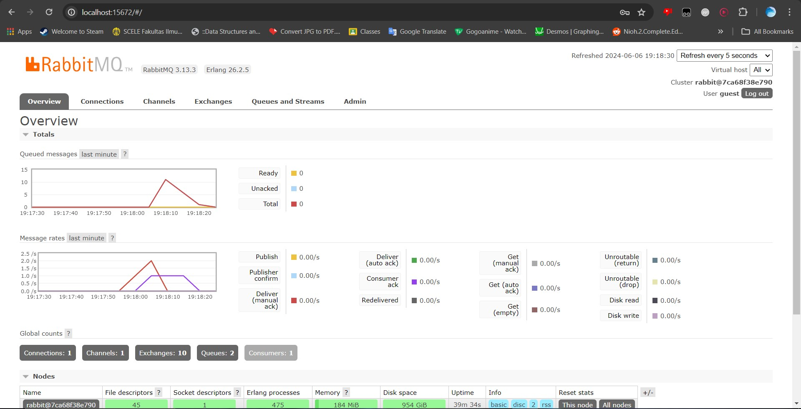

Mochammad Ezar Yudha 2206046746

<h1>Tutorial 8</h1>
<h2>Reflection 1</h2>
<h3>what is amqp?</h2>
AMQP stands for Advanced Message Queuing Protocol. It is an open standard application layer protocol for message-oriented middleware. AMQP is commonly used in message broker software such as RabbitMQ, which facilitates the exchange of messages between producers (senders) and consumers (receivers).

<h3>what it means? guest:guest@localhost:5672 , what is the first quest, and what is
the second guest, and what is localhost:5672 is for?</h3>
The first guest is the username used to authenticate with the message broker. The second guest is the password for the username used to authenticate with the message broker. localhost:5672 is the host and port where the AMQP broker is running.

<h2>Reflection 2</h2>
<h3>In your subscriber directory, edit your Readme.md, add the screen capture of yours, and answer
why the total number of queue is as such (in my machine is 20, what about yours?)</h3>

The total number of queues is the amount of times we ran the publisher program.